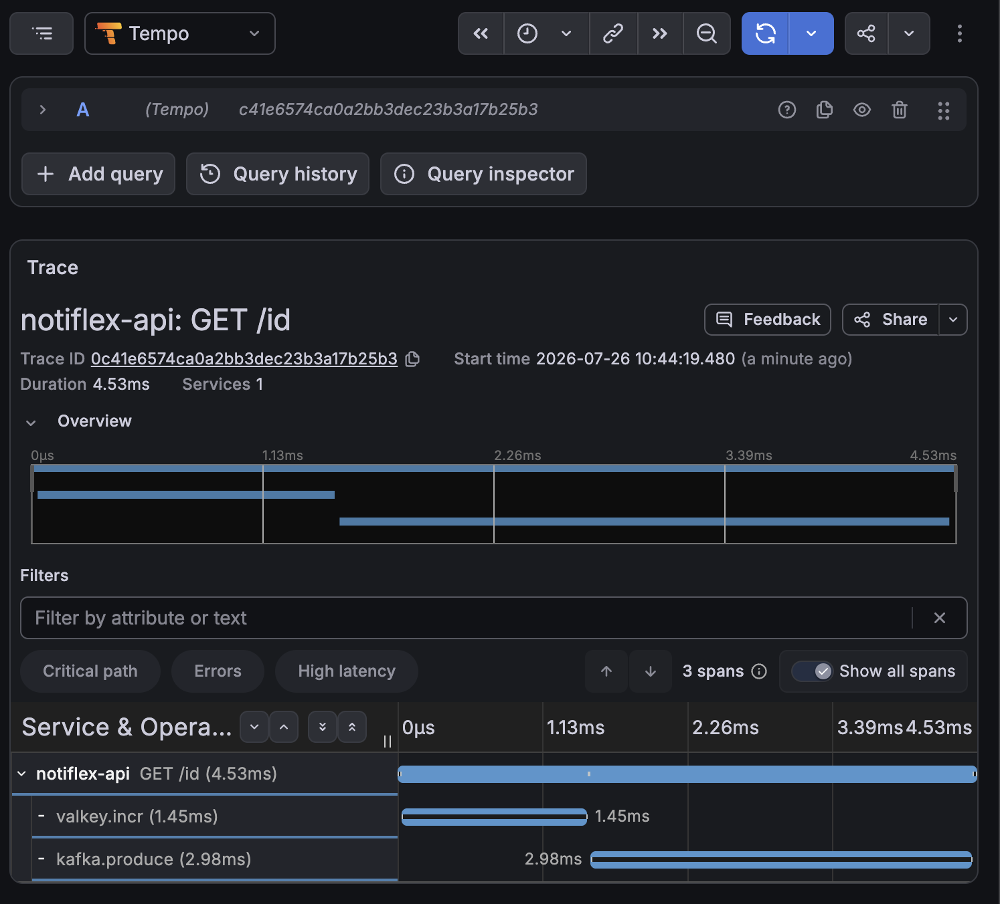

# CH08 - 고도화

> 이 저장소는 「AI 시대에 개발자가 알아야 하는 인프라 구성 배포 with 클로드 코드」 책 스터디를 진행하며 정리한 내용을 다룹니다.

## 이벤트 드리븐

이벤트 드리븐은 프로그램의 시스템 흐름이 어떠한 이벤트에 의해 결정되는 방식을 의미함

현재 Notiflex는 클라이언트가 Post요청을 보내면 API가 알림을 직접 처리하고 응답까지 동기적이다  
발송이 오래 걸리면 API의 응답도 느려지기 때문에 요청 수신과 처리를 분리한다.

이벤트 드리븐을 위한 도구는 Apache Kafka나 NATS, RabbitMQ등 여러 선택지가 있지만 실습에선 카프카를 사용한다

- 클러스터 규모만 보면 `NATS`가 더 매력적인 선택지로 보임
- 실제 회사에서 이벤트 드리븐 시스템을 만난다면 카프카를 만날 확률이 더 높다

카프카에션 파티션 단위로 컨슈머에 작업을 분배한다. 컨슈머가 추가되거나 빠지면 카프카가 파티션을 리밸런싱함, 프로덕션 레벨에서는 컨슈머를 별도 deployment로
분리하고 HPA(Horizontal Pod Autoscaler)로 트래픽에 따라 자동 확장되게 한다.

카프카 설치를 완료하고 나면 Notiflex 코드에 kafka 클라이언트 코드를 적용한다.

<details>
<summary> 카프카 설치 메모 </summary>

Strimzi Operator로 설치하는데, 버전 호환성을 미리 확인해야 한다. Operator가 실제 지원하는 Kafka 버전은 고정돼있어서 아무 버전이나 쓰면 안 됨:

```bash
kubectl get deploy strimzi-cluster-operator -n kafka -o jsonpath='{.spec.template.spec.containers[0].env}'
# STRIMZI_KAFKA_IMAGES: 4.2.0, 4.2.1, 4.3.0 지원 확인 → 4.3.0으로 설치
```

KafkaNodePool/Kafka 리소스에 `nodeSelector`를 바로 못 쓴다. `spec.template.pod.nodeSelector` 필드가 없고, `affinity.nodeAffinity`로 우회해야 한다:

```yaml
template:
  pod:
    affinity:
      nodeAffinity:
        requiredDuringSchedulingIgnoredDuringExecution:
          nodeSelectorTerms:
            - matchExpressions:
                - key: cloud.google.com/gke-nodepool
                  operator: In
                  values: [worker-pool]
```

KRaft 모드라 ZooKeeper 없이 단일 노드(`dual-role`: controller+broker 겸용)로 구성한다. entity-operator는 topicOperator만 켜고 userOperator는 뺀다(KafkaUser 안
쓰니까).

</details>

### Notiflex 코드 변경 (v0.6.0 → v0.7.0)

`github.com/IBM/sarama` 클라이언트를 추가한다. Kafka 브로커가 4.3이라 sarama도 `V4_3_0_0` 버전 상수를 지원하는 최신판(v1.60.0)이 필요하다.

**Producer**: `/id` 핸들러에서 기존 Valkey INCR 이후, 결과를 그대로 `notifications` 토픽에 발행하도록 추가한다.

```go
result, _ := valkeyClient.Do(...).AsInt64()  // 기존 로직
msg, _ := json.Marshal(map[string]any{"id": result, "pod": pod})
kafkaProducer.SendMessage(&sarama.ProducerMessage{
    Topic: notificationsTopic,
    Value: sarama.ByteEncoder(msg),
})
```

Kafka 전송이 실패해도 `/id` 응답 자체는 그대로 나가게 한다 — 로그만 남기고 응답 흐름은 안 막는다. Valkey 연결과 마찬가지로 Producer도 시작 시 10회 재시도 로직을
넣는다(Pod 뜨는 순서상 Kafka가 아직 준비 안 됐을 수 있음).

**Consumer**: `main()`에서 별도 goroutine으로 백그라운드 실행한다.

```go
go runConsumer(kafkaBroker, kafkaCfg)
```

`sarama.ConsumerGroup`으로 `notiflex-api-consumer` 그룹에 join해서 `notifications` 토픽을 구독한다. `sarama.ConsumerGroupHandler`
인터페이스(`Setup`/`Cleanup`/`ConsumeClaim`)를 구현해서 메시지 오면 로그로 출력하는 정도로 단순하게 구현한다. 지금은 Producer와 Consumer가 같은
Pod(notiflex-api) 안에 있는데, 프로덕션이면 위에 적은 것처럼 Consumer는 별도 Deployment로 분리하는 게 맞다.

`rollout.yaml`엔 `KAFKA_BROKER=notiflex-kafka-kafka-bootstrap.kafka.svc.cluster.local:9092` 환경변수를 추가한다. CI가 push 시 이미지 빌드+태그 갱신까지 자동으로
해줘서, 코드 커밋/푸시만으로 배포까지 이어진다.

### 동작 검증

replicas 2로 배포된 상태에서 `/id`를 3번 호출하고 두 Pod의 로그를 확인한다.

```bash
kafka consumed: topic=notifications partition=0 offset=0 value={"id":12,"pod":"notiflex-api-...-tnx9x"} consumer_pod=notiflex-api-...-tkr5q
kafka consumed: topic=notifications partition=1 offset=0 value={"id":13,"pod":"notiflex-api-...-tnx9x"} consumer_pod=notiflex-api-...-tkr5q
kafka consumed: topic=notifications partition=0 offset=1 value={"id":14,"pod":"notiflex-api-...-tnx9x"} consumer_pod=notiflex-api-...-tkr5q
```

`tnx9x` Pod이 요청을 받아 Producer로 메시지를 보내고, **다른 Pod인 `tkr5q`가 Consumer로 그 메시지를 수신**해서 로그에 찍는다. Producer 역할을 한 Pod과 Consumer
역할을 한 Pod이 서로 다르다는 게, "요청 수신과 처리를 분리한다"는 목표가 실제로 동작한다는 증거다.

Consumer Group이 파티션을 나눠 갖는 것도 확인된다

- 3개 메시지가 파티션 0, 1로 분산돼서 들어갔고, 지금은 `tkr5q` Pod 하나가 파티션 0, 1을 전부 담당하는 상태로 보인다(`tnx9x` 로그엔 consumed 기록이 없는데, 아마
  파티션 2를 담당 중인데 거기엔 아직 메시지가 안 갔을 뿐이다).

## 분산 트레이싱

API에서 카프카를 거쳐 컨슈머로 이어지는 흐름이 생겼다 하지만 알림이 안 갔을 때 어디서 막혔는지 추적하기가 어려움  
분산 트레이싱은 하나의 요청이 시스템의 여러 구성을 통과하는 전체 경로를 추적한다.

**Tempo**는 Grafana와 통합이 가능하고 관측 가능성 스택인 프로메테우스, Loki에 연동이 가능하여 현재 인프라 구성에 적합하다

<details>
<summary> Tempo 설치 메모 </summary>

책 가드레일은 ops-pool에 Tempo를 배치하라고 하는데, ops-pool은 7장에서 리전 외부 IP 쿼터 문제로 안 만들었다. 대신 이미 있는 worker-pool에 nodeSelector로
배치한다(worker-pool엔 taint가 없어서 toleration 없이 nodeSelector만으로 충분함).

```yaml
# helm-values/tempo.yaml
nodeSelector:
  cloud.google.com/gke-nodepool: worker-pool
tempo:
  resources:
    requests: { cpu: 25m, memory: 128Mi }
    limits: { cpu: 200m, memory: 256Mi }
  retention: 24h
```

Tempo 차트는 OTLP gRPC(4317)/HTTP(4318) 리시버가 기본값으로 이미 켜져 있어서 따로 설정할 게 없다.

Grafana에 데이터소스로 등록할 때 포트를 헷갈렸다. 서비스 포트 목록에 `tempo-prom-metrics:3200`이라고 이름이 붙어있어서 메트릭 전용 포트인 줄 알았는데, 실제로는
이게 Tempo의 **HTTP 쿼리 API 포트**다(`server.http_listen_port` 기본값이 3200). Grafana datasource URL도 이 포트로 지정해야 한다:

```yaml
url: http://tempo.monitoring.svc.cluster.local:3200
```

Grafana 데이터소스 ConfigMap을 만들 때 `isDefault: false`로 넣었다. 이미 Prometheus가 `isDefault: true`인 상태에서 Tempo까지 true로 넣으면 "여러 개의 기본
데이터소스" 에러로 Grafana가 CrashLoopBackOff에 빠질 수 있다고 가드레일에 나와있어서 미리 방지했다.

</details>

### Notiflex 코드 변경 (v0.7.0 → v0.8.0)

`go.opentelemetry.io/otel` SDK와 `otlptracegrpc` exporter를 추가한다. `main()` 시작 시 트레이서를 초기화하고, 각 HTTP 핸들러에서 span을 만든다.

```go
func initTracer(ctx context.Context) (func(context.Context) error, error) {
    exporter, _ := otlptracegrpc.New(ctx,
        otlptracegrpc.WithEndpoint(os.Getenv("OTEL_EXPORTER_OTLP_ENDPOINT")),
        otlptracegrpc.WithInsecure(),
    )
    res, _ := resource.New(ctx, resource.WithAttributes(
        attribute.String("service.name", "notiflex-api"),
    ))
    tp := sdktrace.NewTracerProvider(sdktrace.WithBatcher(exporter), sdktrace.WithResource(res))
    otel.SetTracerProvider(tp)
    return tp.Shutdown, nil
}
```

`/id` 핸들러 안에서 Valkey 호출과 Kafka 발행을 각각 자식 span으로 감싼다:

```go
ctx, span := tracer.Start(r.Context(), "GET /id")
defer span.End()

_, valkeySpan := tracer.Start(ctx, "valkey.incr")
result, err := valkeyClient.Do(ctx, ...).AsInt64()
valkeySpan.End()

_, kafkaSpan := tracer.Start(ctx, "kafka.produce")
kafkaProducer.SendMessage(...)
kafkaSpan.End()
```

`rollout.yaml`엔 `OTEL_EXPORTER_OTLP_ENDPOINT=tempo.monitoring.svc.cluster.local:4317` 환경변수를 추가한다.

### 동작 검증

`/id`를 3번 호출한 뒤 Tempo API로 직접 조회해서 트레이스가 실제로 들어왔는지 확인한다.

```bash
kubectl port-forward svc/tempo -n monitoring 3200:3200
curl "http://localhost:3200/api/search?q=%7Bname%3D%22GET%20%2Fid%22%7D&limit=3"
```

트레이스 하나를 골라 전체 span을 조회하면 부모-자식 관계가 그대로 보인다.

```text
GET /id  (root, 8ms)
├── valkey.incr
└── kafka.produce
```

`/id` 요청 하나가 Valkey 호출과 Kafka 발행으로 나뉘어서 각각 얼마나 걸렸는지 구간별로 잡힌다. 이게 "요청이 어디서 느린지 알 수 있냐"는 처음 질문에 대한 실제
답이다. Grafana Explore에서도 Tempo 데이터소스로 똑같이 조회된다.



## 배치 자동화: CronJob

"5분마다 API 헬스체크를 자동으로 돌리고 싶다"는 단순 주기 작업엔 K8s 기본 리소스인 **CronJob**이면 충분하다. Airflow나 Argo Workflows는 단계별 의존성이 있는
복잡한 워크플로우용이라 이런 단순 반복 작업엔 과하다.

`k8s/smb/healthcheck-cronjob.yaml`을 만든다. `curlimages/curl` 이미지로 `/health`를 호출해서 200이면 성공, 아니면 exit 1로 실패
처리한다(`restartPolicy: OnFailure`로 자동 재시도).

```yaml
spec:
  schedule: "*/5 * * * *"
  jobTemplate:
    spec:
      template:
        spec:
          nodeSelector:
            cloud.google.com/gke-nodepool: worker-pool
          restartPolicy: OnFailure
          containers:
            - image: curlimages/curl:latest
              command:
                [
                  "sh",
                  "-c",
                  'STATUS=$(curl -s -o /dev/null -w "%{http_code}" http://notiflex-api.notiflex.svc.cluster.local/health); [ "$STATUS" = "200" ] && exit 0 ||
                  exit 1',
                ]
```

5분을 기다리지 않고 바로 검증하려면 CronJob에서 Job을 수동으로 하나 떠보면 된다.

```bash
kubectl create job notiflex-healthcheck-manual-test --from=cronjob/notiflex-healthcheck -n notiflex
kubectl logs job/notiflex-healthcheck-manual-test -n notiflex
# healthcheck OK (status=200)
```

`--from=cronjob/notiflex-healthcheck`는 그 CronJob에 정의된 `jobTemplate`(이미지, command, nodeSelector, resources 등)을 그대로 복사해서 지금 당장 Job 하나를
만드는 옵션이다. 즉 스케줄(5분 주기)만 빼고 실제 CronJob이 자동으로 만들 Job과 완전히 동일한 내용의 Job을 즉석에서 만들어보는 것

- CronJob 자체를 새로 만드는 아이 것라, 이미 `kubectl apply -f healthcheck-cronjob.yaml`로 등록해둔 CronJob을 재료 삼아 테스트용 Job 인스턴스만 하나 뽑아내는
  개념이다.

정상 동작 확인 후 테스트용 Job(`notiflex-healthcheck-manual-test`)만 지운다 — CronJob 본체(`notiflex-healthcheck`)는 그대로 두고 계속 5분마다 자동 실행되게
놔둔다.
